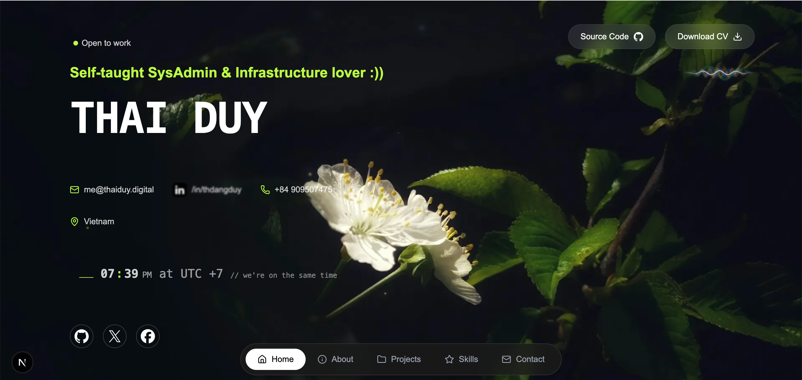
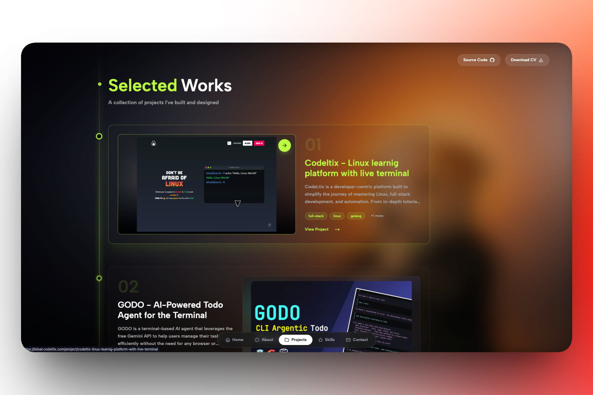
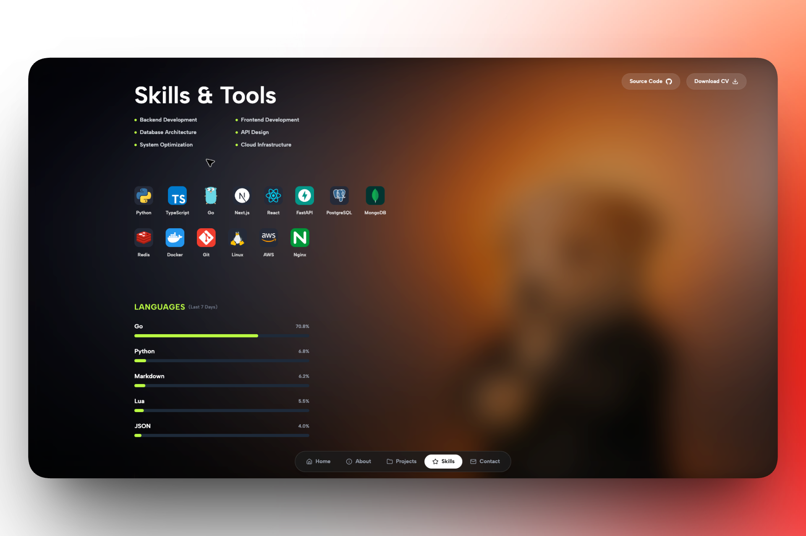
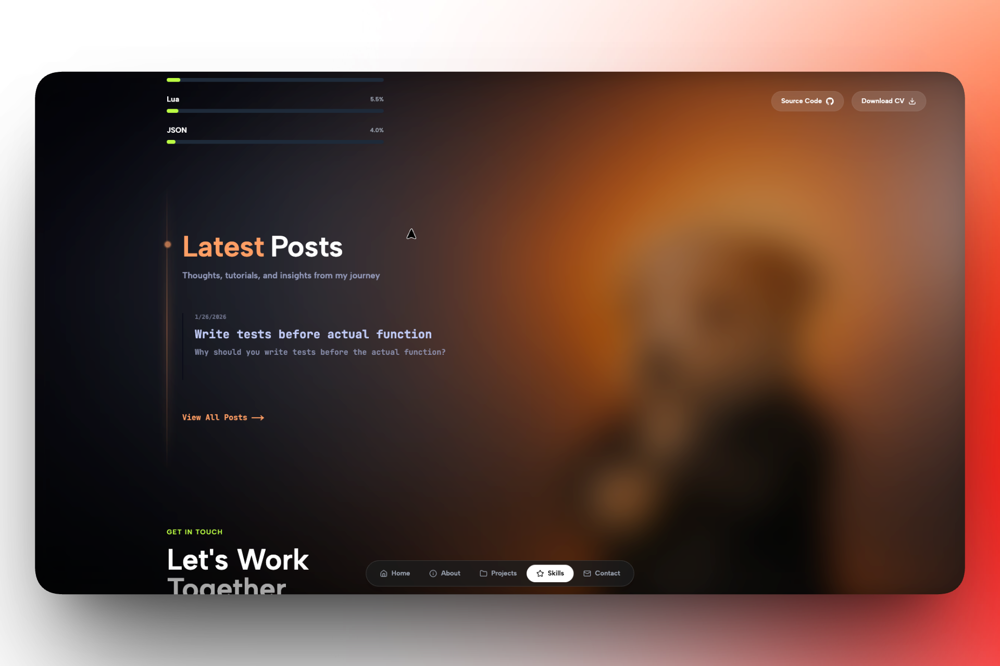
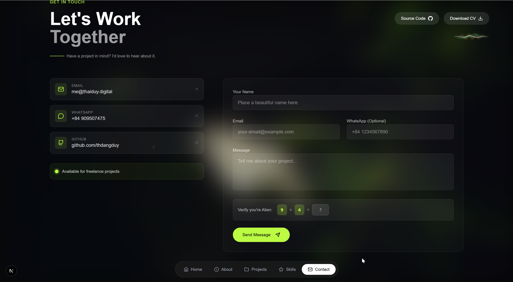
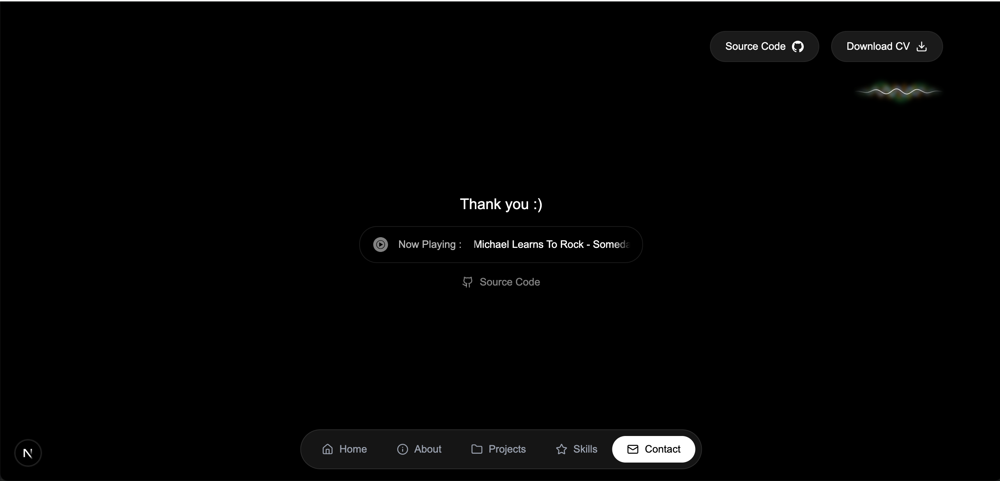

# Portfolio

A modern, full-stack developer portfolio built with Next.js 16, React 19, and Tailwind CSS v4. This project showcases my skills, projects, and thoughts through a clean, dark-themed interface with smooth animations and robust backend integration.

## Live Link [portfolio.thaiduy.digital](https://portfolio.thaiduy.digital)



## 🚀 Tech Stack

- **Framework**: [Next.js 16](https://nextjs.org/) (App Directory)
- **Language**: [TypeScript](https://www.typescriptlang.org/)
- **Styling**: [Tailwind CSS v4](https://tailwindcss.com/)
- **Database**: [MongoDB](https://www.mongodb.com/) with [Prisma ORM](https://www.prisma.io/)
- **Authentication**: [Better Auth](https://www.better-auth.com/)
- **Animations**: [Framer Motion](https://www.framer.com/motion/)
- **UI Components**: [Radix UI](https://www.radix-ui.com/) / Shadcn-like Implementation
- **Icons**: [Lucide React](https://lucide.dev/)
- **Simple Icons** : [simpleicons](https://github.com/icons-pack/react-simple-icons)
- **Content Management**: Custom Blog & Project System
- **Integrations**:
- Telegram Bot (Contact Form)
- Cloudflare R2 (Image Hosting)
- Wakatime (Coding Stats)

## ✨ Features

- **Dynamic Content**: CMS-like features for managing Projects and Blog posts.
- **Admin Dashboard**: Secure admin area for content management.
- **Interactive UI**: Smooth transitions, scroll animations, and a polished dark mode aesthetic.
- **Contact Form**: Direct integration with Telegram for instant message delivery.
- **Real-time Stats**: Live coding statistics via Wakatime API.
- **Dynamic Audio Waveform**: An intelligent SVG visualizer integrated into the navbar that reflects your current listening activity.
- **SEO Optimized**: Built-in metadata and Open Graph support.

### 🎵 WaveformLine Deep Dive

The `WaveformLine` component isn't just a static animation; it's a data-driven visualizer that synchronizes with your Last.fm/YouTube Music status:

- **Genre-Aware Animation**: It parses the current track's metadata (title and artist) to "guess" the music genre using an internal keyword mapping system.
- **Adaptive Physics**: Depending on the detected genre, the waveform automatically adjusts:
  - **Rock/Metal**: High amplitude and high frequency for an energetic look.
  - **Pop/Dance**: Standard rhythmic pulse.
  - **Lo-fi/Jazz/Ambient**: Low amplitude and slow speed for a calm, relaxing vibe.
  - **Classical**: Precise, high-frequency waves with moderate speed.
- **Smooth Transitions**: Built with **Framer Motion**, the waveform gracefully morphs between different states when the music genre changes.
- **Real-time Connectivity**: Fetches live "Now Playing" data to ensure the visualizer stays in sync with your actual activity.

## Screenshots

### Projects



|            Skills            |           Blog            |
| :--------------------------: | :-----------------------: |
|  |  |

### Contact



### Music Player



## 🛠️ Getting Started

### Prerequisites

- Node.js (v18+ recommended)
- MongoDB Database or MongoDB Atlas
- Cloudflare R2 Storage Account
- Telegram Bot Token (optional, for contact form)

### Installation

1. **Clone the repository:**

   ```bash
   git clone https://github.com/thdangduy/portfolio.git
   cd portfolio
   ```

2. **Install dependencies:**

   ```bash
   npm install
   # or
   pnpm install
   # or
   bun install (recommended)
   ```

3. **Environment Setup:**

   Rename `.env.example` to `.env` and fill in your secrets:

   ```bash
   cp .env.example .env
   ```

   Required variables:
   - `DATABASE_URL`: MongoDB connection string
   - `BETTER_AUTH_SECRET`: Secret for authentication
   - `ADMIN_SECRET`: Secret header for admin actions
   - `TELEGRAM_BOT_TOKEN` & `TELEGRAM_CHAT_ID`: For contact form
   - `CLOUDFLARE_R2_ENDPOINT`: Cloudflare R2 endpoint
   - `CLOUDFLARE_R2_BUCKET`: R2 bucket name
   - `CLOUDFLARE_R2_ACCESS_KEY_ID`: R2 access key ID
   - `CLOUDFLARE_R2_SECRET_ACCESS_KEY`: R2 secret key
   - `NEXT_PUBLIC_CLOUDFLARE_R2_BASE_URL`: Public R2 base URL for uploaded images
   - `LASTFM_API_KEY`: Last.fm API key
   - `LASTFM_USER`: Last.fm username
   - `WAKATIME_API_KEY`: Wakatime API key - change url at /portfolio/app/page.tsx

4. **Database Setup:**

   Generate Prisma client and push schema:

   ```bash
   npx prisma generate
   npx prisma db push
   ```

5. **Run Development Server:**

   ```bash
   npm run dev
   ```

   Open [http://localhost:3000](http://localhost:3000) to view the site.

## 🛣️ Routes

### Pages

- `/`: Home Page (Intro, About, Skills, etc.)
- `/projects`: All Projects List
- `/project/[slug]`: Single Project Details
- `/blog`: Blog Posts
- `/contact`: Contact Page
- `/login`: Admin Login

### Admin Routes (Protected)

- `/blog/editor`: Create/Edit Blog Posts (Admin can edit or remove posts)
- `/projects/form`: Create/Edit Projects (Admin can edit or remove projects)

### API Endpoints

- `GET /api/projects`: Fetch all projects
- `POST /api/projects`: Create a new project (Admin)
- `GET /api/blog/[slug]`: Get a specific blog post
- `POST /api/contact`: Send a contact message

## 📂 Project Structure

- `/app`: Next.js App Router pages and API routes.
- `/components`: Reusable UI components.
- `/lib`: Utility functions, Prisma client, and configurations.
- `/prisma`: Database schema.
- `/public`: Static assets.

## 👤 Author

`// Built with ❤️ by Thai Duy. Inspired by` [Avisek Ray (biisal)][def]

## 📄 License

This project is licensed under the MIT License.

[def]: https://github.com/biisal
